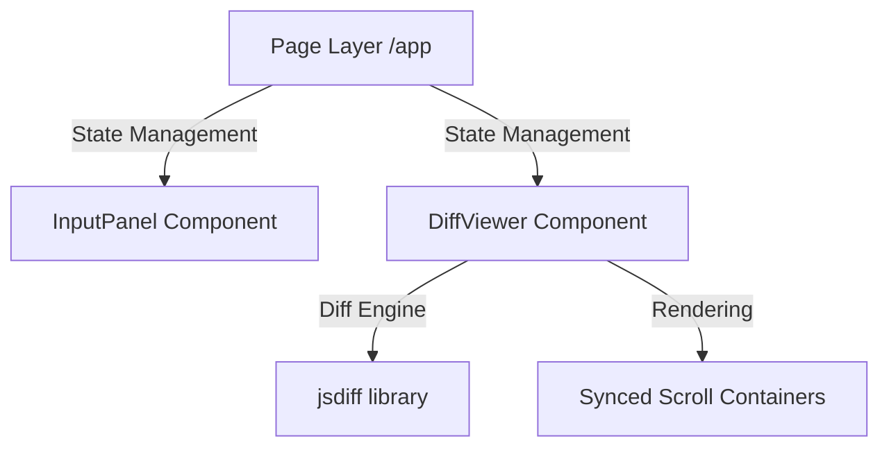

# Side-by-Side Diff Viewer - Developer Documentation

> Comprehensive documentation for developers working on Side-by-Side Diff Viewer.

**Version:** 0.1.0 | **Last Updated:** 2026-02-19

---

## Table of Contents

- [Architecture Overview](#architecture-overview)
- [Project Structure](#project-structure)
- [Naming Conventions](#naming-conventions)
- [Commands](#commands)
- [Troubleshooting](#troubleshooting)

---

## Architecture Overview

Side-by-Side Diff Viewer follows a **Component-based App Router** architecture using Next.js 16.



### Key Design Decisions

| Decision | Rationale |
|----------|-----------|
| **jsdiff Algorithm** | Robust, well-tested library for Myers' diff and character-level comparisons. |
| **Synced Scrolling** | Critical for side-by-side comparison accuracy; implemented via React refs. |
| **web/ Subdirectory** | Keeps the project root clean for documentation and multi-package potential. |

---

## Project Structure

```
diff/
├── web/                       # Next.js Application
│   ├── src/
│   │   ├── app/               # Layouts, globals, and main page
│   │   └── components/        # Isolated UI components
│   └── package.json           # App dependencies
├── README.md                  # User-facing documentation
├── DEVELOPMENT.md             # This file
├── CHANGELOG.md               # Version history
└── LICENSE.md                 # License terms
```

---

## Naming Conventions

### Files & Directories

| Type | Convention | Example |
|------|-----------|---------|
| **Components** | PascalCase | `DiffViewer.js` |
| **Styles** | kebab-case | `globals.css` |
| **Internal Pages** | kebab-case | `page.js` |

---

## Commands

### Development

```bash
cd web
npm run dev
```

### Production Build

```bash
cd web
npm run build
```

---

## Troubleshooting

### Common Issues

| Issue | Solution |
|-------|----------|
| **Scrolling out of sync** | Reset the window size or check if both panels have identical content lengths. |
| **Layout tags missing** | Ensure `src/app/layout.js` contains both `<html>` and `<body>` tags. |

---

<p align="center">
  <a href="README.md">← Back to README</a>
</p>
