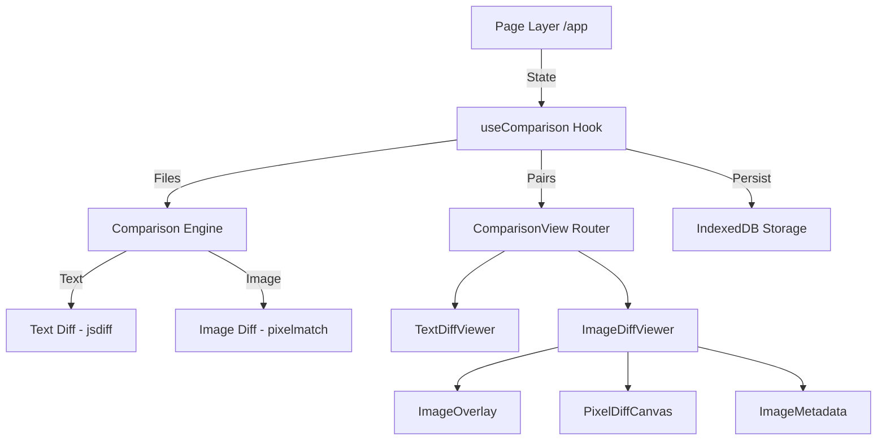

# Diffs - Developer Documentation

> Comprehensive documentation for developers working on Diffs.

**Version:** 0.2.0 | **Last Updated:** 2026-02-26

---

## Table of Contents

- [Architecture Overview](#architecture-overview)
- [Project Structure](#project-structure)
- [Naming Conventions](#naming-conventions)
- [Key Components](#key-components)
- [Commands](#commands)
- [Troubleshooting](#troubleshooting)
- [Contributing](#contributing)

---

## Architecture Overview

Diffs follows a **modular, component-based** architecture using Next.js 16 App Router with TypeScript.



### Key Design Decisions

| Decision | Rationale |
|----------|-----------|
| **Plugin-style engine** | `engine.ts` dispatches comparisons by file type, making it trivial to add new formats (e.g., JSON, CSV). |
| **TypeScript strict mode** | Catches type errors at build time, critical for a tool that processes arbitrary file data. |
| **Client-side only** | All comparison logic runs in the browser — no server, no uploads, no data leaves the machine. |
| **IndexedDB persistence** | Files survive page reloads without a backend. Manual clear keeps users in control. |
| **Monochrome design** | Eliminates visual noise so users focus on the comparison content. Color only for functional indicators. |
| **Scroll-to-zoom** | Images fit viewport by default; scroll wheel provides progressive zoom without mode switching. |

---

## Project Structure

```
diffs/
├── diffs/                         # Next.js Application
│   ├── src/
│   │   ├── app/                   # Pages, layouts, global styles
│   │   │   ├── layout.tsx         # Root layout, fonts, metadata
│   │   │   ├── page.tsx           # Main app page (toolbar, input, results)
│   │   │   └── globals.css        # Design tokens, all component styles
│   │   ├── components/
│   │   │   ├── comparison/        # Comparison viewers
│   │   │   │   ├── ComparisonView.tsx       # Routes pairs to correct viewer
│   │   │   │   ├── FileDropZone.tsx         # Drag-and-drop file input
│   │   │   │   ├── OriginalSelector.tsx     # File cards with original selection
│   │   │   │   ├── text/
│   │   │   │   │   ├── TextDiffViewer.tsx   # Side-by-side text diff
│   │   │   │   │   └── TextInputPanel.tsx   # Quick text input mode
│   │   │   │   └── image/
│   │   │   │       ├── ImageDiffViewer.tsx   # Image comparison orchestrator
│   │   │   │       ├── ImageOverlay.tsx      # Slider overlay comparison
│   │   │   │       ├── PixelDiffCanvas.tsx   # Pixel-level diff view
│   │   │   │       └── ImageMetadata.tsx     # Metadata comparison table
│   │   │   ├── layout/
│   │   │   │   ├── Header.tsx     # App header/branding
│   │   │   │   └── Footer.tsx     # App footer
│   │   │   └── ui/
│   │   │       ├── Tabs.tsx       # Reusable tab component
│   │   │       └── Badge.tsx      # Status badge component
│   │   ├── hooks/
│   │   │   ├── useComparison.ts   # Core state management + IndexedDB
│   │   │   ├── useFileUpload.ts   # File processing + drag/drop
│   │   │   ├── useScrollSync.ts   # Synchronized scroll for diff panels
│   │   │   └── useImageZoom.ts    # Scroll-to-zoom + drag-to-pan
│   │   └── lib/
│   │       ├── types.ts           # All TypeScript interfaces
│   │       ├── constants.ts       # App constants
│   │       ├── comparison/
│   │       │   ├── engine.ts      # Comparison dispatcher (text/image)
│   │       │   ├── text.ts        # Text diff algorithms
│   │       │   └── image.ts       # Image diff (pixelmatch + metadata)
│   │       └── utils/
│   │           └── storage.ts     # IndexedDB read/write/clear
│   ├── public/
│   │   └── diffs.png              # App icon / favicon
│   ├── package.json
│   └── tsconfig.json
├── README.md                      # User-facing documentation
├── DEVELOPMENT.md                 # This file
├── CHANGELOG.md                   # Version history
├── TASKS.md                       # Planned features and known issues
└── LICENSE.md                     # License terms
```

---

## Naming Conventions

### Files & Directories

| Type | Convention | Example |
|------|-----------|---------|
| **Components** | PascalCase `.tsx` | `TextDiffViewer.tsx`, `ImageOverlay.tsx` |
| **Hooks** | camelCase with `use` prefix | `useComparison.ts`, `useImageZoom.ts` |
| **Lib / Utils** | camelCase `.ts` | `engine.ts`, `storage.ts` |
| **Styles** | kebab-case | `globals.css` |
| **Types** | camelCase `.ts` | `types.ts` |

### Functions & Methods

| Prefix | Purpose | Example |
|--------|---------|---------|
| `handle` | Event handler | `handleDrop()`, `handleFilesSelected()` |
| `compute` | Diff computation | `computeTextDiff()`, `computeImageDiff()` |
| `render` | Rendering helper | `renderSide()`, `renderPair()` |
| `use` | React hook | `useComparison()`, `useImageZoom()` |
| `is` / `has` | Boolean check | `isComparing`, `hasResults` |
| `add` / `remove` / `select` | State mutation | `addFiles()`, `removeFile()`, `selectOriginal()` |

---

## Key Components

### Comparison Engine (`lib/comparison/engine.ts`)

Dispatches files to the correct comparison module based on MIME type.

| Function | Description |
|----------|-------------|
| `runComparison()` | Takes all files + original ID, returns `ComparisonPair[]` with results |

### useComparison Hook (`hooks/useComparison.ts`)

Central state management for files, original selection, comparison pairs, and IndexedDB persistence.

| Method | Description |
|--------|-------------|
| `addFiles()` | Add processed files to state, auto-persist to IndexedDB |
| `removeFile()` | Remove a file by ID |
| `selectOriginal()` | Set the original file for comparison |
| `runComparison()` | Execute comparison engine and store results |
| `reset()` | Clear state + IndexedDB |

### useImageZoom Hook (`hooks/useImageZoom.ts`)

Scroll-to-zoom and drag-to-pan for image containers.

| Property | Description |
|----------|-------------|
| `containerStyle` | CSS transform styles to apply to the zoomable element |
| `containerProps` | Event handlers (wheel, mouse) to attach to the container |
| `isZoomed` | Whether zoom level > 1x |
| `resetZoom()` | Reset to 1x |

---

## Commands

### Development

```bash
cd diffs
npm run dev
```

### Production Build

```bash
cd diffs
npm run build
```

### Lint

```bash
cd diffs
npm run lint
```

---

## Troubleshooting

### Common Issues

| Issue | Solution |
|-------|----------|
| **PowerShell blocks npm scripts** | Run via `cmd /c "npm install"` instead, or adjust ExecutionPolicy. |
| **Images cut off in overlay** | Ensure `globals.css` has `max-width: 100%; max-height: 100%` on `.overlay-image-bg`. |
| **IndexedDB not restoring** | Check browser devtools → Application → IndexedDB → `diffs-store`. Clear and re-upload if corrupt. |
| **Favicon not showing** | Delete any `favicon.ico` in `public/`. The app uses `diffs.png` via Next.js metadata. |

---

## Contributing

### Commit Messages

Follow **Conventional Commits** format:

```
type(scope): short description
```

| Type | Purpose |
|------|---------|
| `feat` | New feature |
| `fix` | Bug fix |
| `docs` | Documentation only |
| `refactor` | Code change that neither fixes a bug nor adds a feature |
| `chore` | Build, CI, tooling changes |

### Code Style

- TypeScript strict mode — no `any` unless absolutely necessary
- Self-documenting code with section-based comments
- Prefer existing patterns in the codebase
- No new dependencies without explicit approval

---

<p align="center">
  <a href="README.md">← Back to README</a>
</p>
